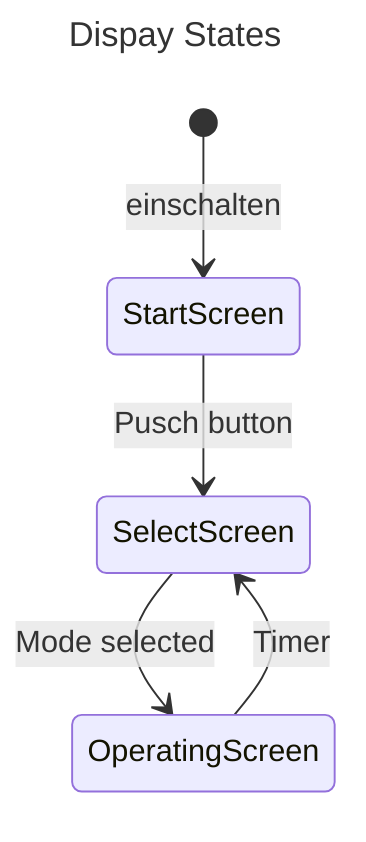

# pressure-controller

```mermaid
---
title: Hardware States
---
stateDiagram-v2

[*] --> idleS
idleS --> releasePressureS :modeSelected


releasePressureS --> holdPressureS:selectedRoutine

%%releasePressureS --> pumpingPressureS :selectedRoutine

pumpingPressureS --> holdPressureS:selectedRoutine
pumpingPressureS --> releasePressureS :faultSoftware
pumpingPressureS --> releasePressureS :eventSafety_SW
holdPressureS --> pumpingPressureS :selectedRoutine
holdPressureS --> releasePressureS :selectedRoutine
holdPressureS --> releasePressureS :faultSoftware
holdPressureS --> releasePressureS :eventSafety_SW
  releasePressureS --> [*]:pressureReleased
```

```mermaid
---
title: Dispay States
---
stateDiagram-v2
    [*] --> StartScreen: einschalten
   StartScreen --> SelectScreen: Pusch button
   SelectScreen --> OperatingScreen: Mode selected
  OperatingScreen --> SelectScreen: Timer

```
