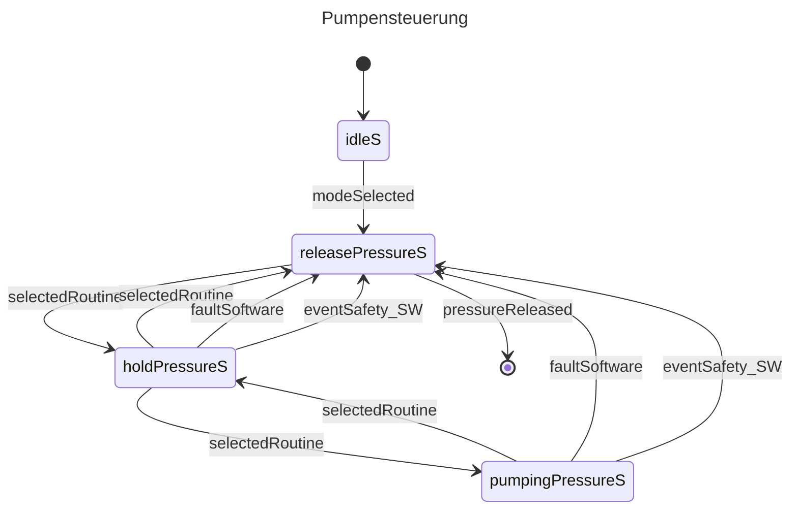
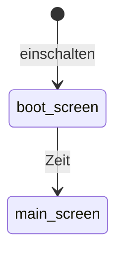

# Pumpensteuerung

```mermaid
---
title: Pumpensteuerung
---
stateDiagram-v2

[*] --> idleS
idleS --> releasePressureS :modeSelected 


releasePressureS --> holdPressureS:selectedRoutine                  

%%releasePressureS --> pumpingPressureS :selectedRoutine

pumpingPressureS --> holdPressureS:selectedRoutine
pumpingPressureS --> releasePressureS :faultSoftware
pumpingPressureS --> releasePressureS :eventSafety_SW
holdPressureS --> pumpingPressureS :selectedRoutine
holdPressureS --> releasePressureS :selectedRoutine
holdPressureS --> releasePressureS :faultSoftware
holdPressureS --> releasePressureS :eventSafety_SW
  releasePressureS --> [*]:pressureReleased
```

```mermaid

stateDiagram-v2
    [*] --> boot_screen: einschalten
   boot_screen --> main_screen: Zeit

```
